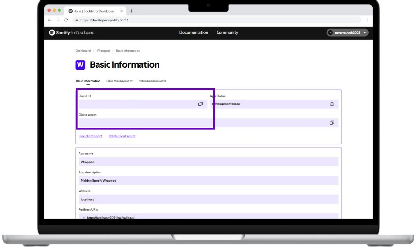
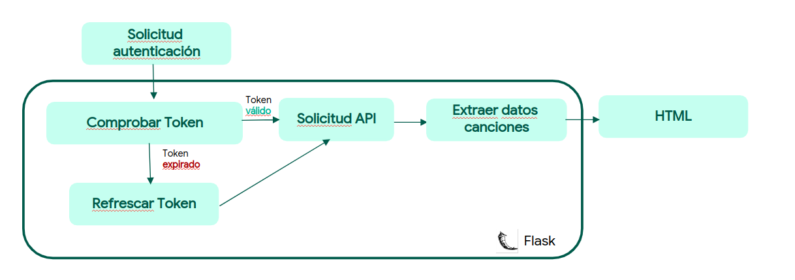

# 🎶 Spotify Wrapped Personalizado 🎶

Una aplicación web de Flask que permite a los usuarios obtener sus artistas y canciones más escuchadas en Spotify haciendo uso de la API de Spotify.

## 📋 Tabla de Contenidos
- [✨ Introducción](#-introducción)
- [⚙️ Requisitos](#️-requisitos)
- [🔧 Configuración](#-configuración)
- [🚀 Ejecución](#-ejecución)
- [🛠️ Arquitectura ](#-Arquitectura)

---

## ✨ Introducción

Esta aplicación permite a los usuarios iniciar sesión con su cuenta de Spotify y obtener un análisis de sus datos de escucha. Podrán ver sus artistas y canciones favoritas, así como los géneros que más escuchan. Está construida usando Flask, y se conecta a la API de Spotify para recopilar esta información.

### 🔹 Características principales:
- ✅ Autenticación a través de la cuenta de Spotify.
- 🎤 Obtención de los top artistas y canciones del usuario.
- 🎧 Visualización de los géneros más escuchados a través de la web.

## ⚙️ Requisitos

1. **Cuenta en [Spotify for Developers](https://developer.spotify.com/)**: Necesitarás crear una aplicación para obtener el `CLIENT_ID` y `CLIENT_SECRET`. 

2. **Spotify API Credentials**: Una vez que hayas creado la aplicación, obtén tus credenciales de:
   - `CLIENT_ID`
   - `CLIENT_SECRET`
   - Configura el **Redirect URI** de tu aplicación en Spotify a `http://localhost:5000/callback`.

El `CLIENT_ID` y el `CLIENT_SECRET` lo encontraréis dentro de la información de la aplicación.



3. **Python 3.10**: Usa `pyenv` para asegurarte de que tienes la versión correcta de Python.

4. **Poetry**: Para gestionar las dependencias de Python, asegúrate de tener instalado `poetry`.

## 🔧 Configuración

1. Clona el repositorio y navega al directorio del proyecto:
   ```bash
   git clone https://github.com/RuthNavarroCarrasco/Spotify-API.git
   cd Spotify-API
   ```
2. Crea un archivo `.env` en la raíz del proyecto con las siguientes variables:
    ```bash
    CLIENT_ID="foo"
    CLIENT_SECRET="bar"
    ```
3. Instala las dependencias y configura el entorno
    ```bash
    make setup
    ```
## 🚀 Ejecución
Primero abre una shell de poetry

```bash
make shell
```

Luego inicia la aplicación para ver tus artistas y canciones más escuchadas

```bash
make run
```

La aplicación estará disponible en `http://localhost:5000`.


## 🛠️ Arquitectura

El siguiente diagrama muestra el flujo de autenticación y cómo la aplicación interactúa con la API de Spotify para extraer los datos de las canciones y renderizar la salida en HTML.



### Explicación del Flujo

1. **Solicitud de autenticación**: El proceso comienza cuando el usuario inicia sesión en la aplicación. Esto genera una solicitud de autenticación que redirige al usuario a Spotify para autorizar la aplicación.

2. **Comprobar Token**: Al recibir el código de autorización de Spotify, la aplicación solicita un token de acceso. Este token es necesario para hacer solicitudes a la API de Spotify en nombre del usuario.

   - Si el **token es válido**, la aplicación continúa al siguiente paso.
   - Si el **token ha expirado**, se activa un proceso de "Refrescar Token" para obtener un nuevo token sin que el usuario tenga que iniciar sesión de nuevo.

3. **Refrescar Token**: En caso de que el token haya expirado, la aplicación utiliza el "refresh token" para solicitar un nuevo token de acceso. Esto permite mantener la sesión activa y evita que el usuario tenga que autenticarse de nuevo.

4. **Solicitud API**: Una vez que se ha comprobado o refrescado el token, la aplicación realiza solicitudes a la API de Spotify para obtener datos específicos, como los artistas y canciones más escuchados del usuario.

5. **Extraer datos de canciones**: Los datos obtenidos de la API de Spotify se procesan para extraer detalles como el nombre de las canciones, artistas, géneros, y otros elementos relevantes.

6. **Renderizar HTML**: Finalmente, los datos extraídos se pasan a una plantilla HTML en Flask, que se muestra al usuario en el navegador.

Este flujo asegura que la aplicación maneje de manera segura y eficiente la autenticación y autorización de los usuarios, mientras proporciona un análisis de sus preferencias de Spotify.